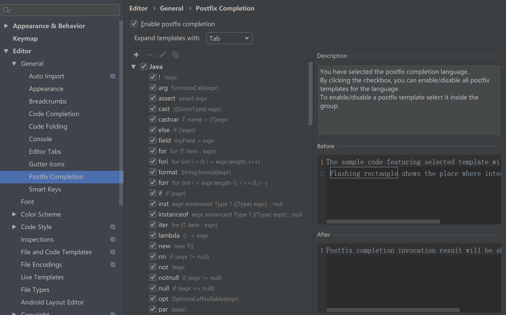
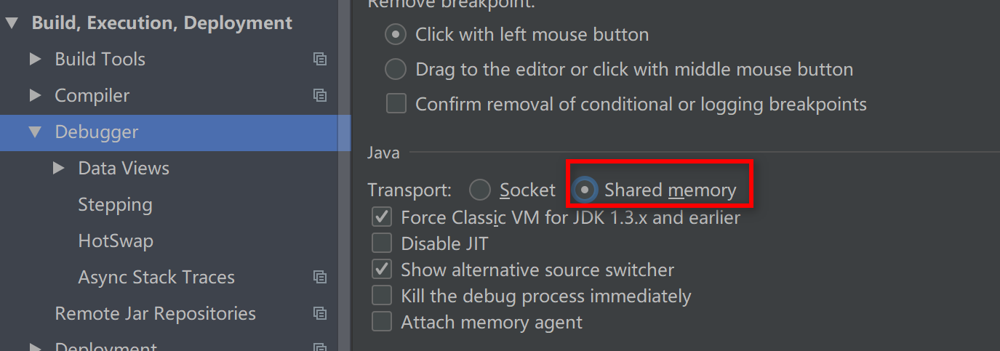

# IDEA配置及使用

## 配置VM

**源文件**

```
-Xms128m
-Xmx750m
-XX:ReservedCodeCacheSize=240m
-XX:+UseConcMarkSweepGC
-XX:SoftRefLRUPolicyMSPerMB=50
-ea
-Dsun.io.useCanonCaches=false
-Djava.net.preferIPv4Stack=true
-Djdk.http.auth.tunneling.disabledSchemes=""
-XX:+HeapDumpOnOutOfMemoryError
-XX:-OmitStackTraceInFastThrow
```

**这里以我的电脑系统(64 位 windows7，16G 内存)为例，说明一下如何调整 VM 配置文件：**

```
-Xms512m
-Xmx1500m
-XX:ReservedCodeCacheSize=500m
-XX:+UseConcMarkSweepGC
-XX:SoftRefLRUPolicyMSPerMB=50
-ea
-Dsun.io.useCanonCaches=false
-Djava.net.preferIPv4Stack=true
-Djdk.http.auth.tunneling.disabledSchemes=""
-XX:+HeapDumpOnOutOfMemoryError
-XX:-OmitStackTraceInFastThrow
```


## 查看设置目录结构

这是 IDEA 的各种配置的保存目录。这个设置目录有一个特性，就是你删除掉整个目录之后，重新启动 IntelliJ IDEA 会再自动帮你生成一个全新的默认配置，所以很多时候如果你把 IntelliJ IDEA 配置改坏了，没关系，删掉该目录，一切都会还原到默认。

### config 目录

config 目录是 IntelliJ IDEA 个性化化配置目录，或者说是整个 IDE 设置目录。此目录可看成是最重要的目录，没有之一，如果你还记得安装篇的介绍的时候，安装新版本的 IntelliJ IDEA 会自动扫描硬盘上的旧配置目录，指的就是该目录。这个目录主要记录了：IDE 主要配置功能、自定义的代码模板、自定义的文件模板、自定义的快捷键、Project 的 tasks 记录等等个性化的设置。

### system 目录

system 是 IntelliJ IDEA 系统文件目录，是 IntelliJ IDEA 与开发项目一个桥梁目录，里面主要有：缓存、索引、容器文件输出等等，虽然不是最重要目录，但也是最不可或缺的目录之一。


## 启动应用后简单配置

### 设置显示常见的视图


## 创建模块(Module)

- 在 Eclipse 中我们有 Workspace（工作空间）和 Project（工程）的概念，在 IDEA中只有 Project（工程）和 Module（模块）的概念。这里的对应关系为：
  - IDEA 官网说明：
    - An Eclipse workspace is similar to a project in IntelliJ IDEA 
    - An Eclipse project maps to a module in IntelliJ IDEA
  - 翻译：
    - Eclipse 中 workspace 相当于 IDEA 中的 Project
    - Eclipse 中 Project 相当于 IDEA 中的 Module
- 从 Eclipse 转过来的人总是下意识地要在同一个窗口管理 n 个项目，这在IntelliJ IDEA 是无法做到的。IntelliJ IDEA 提供的解决方案是打开多个项目实例，即打开多个项目窗口。即：一个 Project 打开一个 Window 窗口。
- 在 IntelliJ IDEA 中 Project 是最顶级的级别，次级别是 Module。一个 Project 可以有多个 Module。目前主流的大型项目都是分布式部署的，结构都是类似这种多 Module 结构
- 
- 相比较于多 Module 项目，小项目就无需搞得这么复杂。只有一个 Module 的结构 IntelliJ IDEA 也是支持的，并且 IntelliJ IDEA 创建项目的时候，默认就是单Module 的结构的。
- 创建：详见演示
- 删除：详见演示
- 查看项目配置：详见演示

## 常用配置

### 进入设置界面：


## 目录结构如下


### Appearance & Behavior

#### 设置主题


#### 设置窗体及菜单的字体及字体大小 (可忽略)


#### 如果想要更多的主题效果的话，可以到如下的网站下载：
- http://www.riaway.com/

- 下载以后，导入主题：（方式一）file –> import setttings –> 选中下载的主题 jar 文件 –> 一路确认 –> 重启。重启以后，新主题会自动启用。

- 下载以后，导入主题：（方式二）

  - 


### Editor - General

#### 设置鼠标滚轮修改字体大小(可忽略)


#### 设置鼠标悬浮提示


#### 设置自动导包功能


- Add unambiguous imports on the fly：自动导入不明确的结构
- Optimize imports on the fly：自动帮我们优化导入的包

#### 设置显示行号和方法间的分隔符


- 如上图红圈所示，可以勾选 Show line numbers：显示行数。我建议一般这个要勾选上。
- 如上图红圈所示，可以勾选 Show method separators： 显示方法分隔线。这种线有助于我们区分开方法，所以建议勾选上。

#### 忽略大小写提示


#### 设置取消单行显示 tabs 的操作


#### 修改代码中注释的字体颜色


### Editor – Code Style

#### 设置超过指定 import 个数，改为* (可忽略)


###  Editor – File and Code Templates

#### 修改类头的文档注释信息


```
/**
@author gs
@create ${YEAR}-${MONTH}-${DAY} ${TIME}
*/
```

**常用的预设的变量，这里直接贴出官网给的：**

```
${PACKAGE_NAME} - the name of the target package where the new class or interface will be created. 
${PROJECT_NAME} - the name of the current project. 
${FILE_NAME} - the name of the PHP file that will be created. 
${NAME} - the name of the new file which you specify in the New File dialog box during the file creation. 
${USER} - the login name of the current user. 
${DATE} - the current system date. 
${TIME} - the current system time. 
${YEAR} - the current year. 
${MONTH} - the current month. 
${DAY} - the current day of the month. 
${HOUR} - the current hour. 
${MINUTE} - the current minute. 
${PRODUCT_NAME} - the name of the IDE in which the file will be created. 
${MONTH_NAME_SHORT} - the first 3 letters of the month name. Example: Jan, Feb, etc. 
${MONTH_NAME_FULL} - full name of a month. Example: January, February, etc.
```

### Editor – File Encodings

#### 设置项目文件编码


- 说明：Transparent native-to-ascii conversion 主要用于转换 ascii，一般都要勾选，
  不然 Properties 文件中的注释显示的都不会是中文

### Build,Execution,Deployment

#### 设置自动编译


#### 设置为省电模式 (可忽略)


**如上图所示，IntelliJ IDEA 有一种叫做 省电模式 的状态，开启这种模式之后IntelliJ IDEA 会关掉代码检查和代码提示等功能。所以一般也可认为这是一种 阅读模式，如果你在开发过程中遇到突然代码文件不能进行检查和提示，可以来看看这里是否有开启该功能。**

#### 设置代码水平或垂直显示


## 快捷键(Keymap)


- 导入笔记中的快捷方式配置
- 

## 关于模板(Templates)

### Live Templates(实时代码模板)功能介绍

它的原理就是配置一些常用代码字母缩写，在输入简写时可以出现你预定义的固定模式的代码，使得开发效率大大提高，同时也可以增加个性化。最简单的例子就是在 Java 中输入 sout 会出现 System.out.println();

### 已有的常用模板

#### Postfix Completion 默认如下：



#### Live Templates 默认如下：


**二者的区别：Live Templates 可以自定义，而 Postfix Completion 不可以。同时，
有些操作二者都提供了模板，Postfix Templates 较 Live Templates 能快 0.01 秒**

#### 输出

-  sout : System.out.println()
- soutp : System.out.println("方法形参名 = " + 形参名);
- soutv : System.out.println("变量名 = " + 变量);
- soutm : System.out.println("当前类名.当前方法");
- “abc”.sout  :  System.out.println("abc");

#### 循环

- fori  : 可生成 for 循环
- iter：可生成增强 for 循环
- itar：可生成普通 for 循环
- list.for : 可生成集合 list 的 for 循环
- list.fori : 可生成集合 list 的 for 循环
- list.forr : 可生成集合 list 的 for 循环

#### 分支

- ifn：可生成 if(xxx = null)
- inn：可生成 if(xxx != null) 或 xxx.nn 或 xxx.null
- xxx.nn ：if(xxx!=null)
-  xxx.null：if(xxx==null)

#### 访问控制符与关键字

- prsf：可生成 private static final
- psf：可生成 public static final
- psfi：可生成 public static final int
- psfs：可生成 public static final String

### 修改现有模板:Live Templates


### 自定义模板

IDEA 提供了很多现成的 Templates。但你也可以根据自己的需要创建新的Template。


先定义一个模板的组：custom 


1. Abbreviation:模板的缩略名称
2. Description:模板的描述
3. Template text:模板的代码片
4. 应用范围。比如点击 Define。


## 断点调试

### Debug 的设置



- 设置 Debug 连接方式，默认是 Socket。Shared memory 是 Windows 特有的一个属性，一般在 Windows 系统下建议使用此设置，内存占用相对较少

### 常用断点调试快捷键

